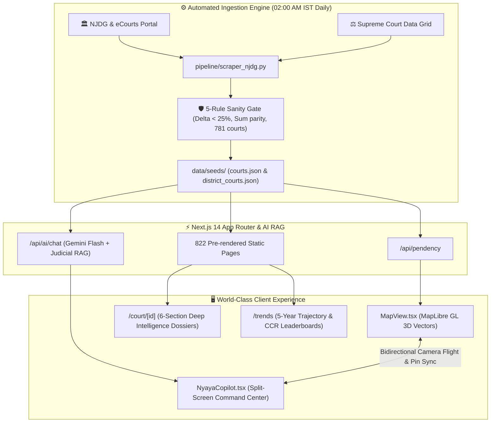

<div align="center">

# ⚖️ NyayaRadar — National Judicial Intelligence Platform
### *A Real-Time Geospatial Intelligence System Mapping Where India's Justice is Stuck*

[](https://nextjs.org/)
[](https://www.typescriptlang.org/)
[](https://tailwindcss.com/)
[](https://maplibre.org/)
[](https://ai.google.dev/)
[](https://www.python.org/)
[](https://github.com/shauryap9006-cell/nyayaradar/actions)
[](https://opensource.org/licenses/MIT)

<br/>

```
 ┌─────────────────────────────────────────────────────────────┬────────────────────────────────┐
 │ 🗺️ National Map (781 Courts Mapped in 3D)                   │ 🤖 NyayaAI Copilot • Map Ctrl  │
 │                                                             │                                │
 │   • Supreme Court of India (Apex White Shield)              │ 💬 "Fastest Bail in MH":       │
 │   • 25 State High Courts (Obsidian Pillars)                 │   • 🥇 Sindhudurg (8 Days)     │
 │   • 755 Subordinate District Courts (Diamonds)              │   • 📈 104% CCR (Clearing)     │
 │   • 3D State Boundary Extrusions (22,000m Elevation)        │   • 📞 Free Legal Aid: 15100   │
 │   • Instant Fuzzy Search across all 781 courts              │   • 📍 Auto-Fly Camera to GPS  │
 └─────────────────────────────────────────────────────────────┴────────────────────────────────┘
```

</div>

---

## 🌟 Overview

**NyayaRadar** is an open-source, civic-tech judicial intelligence platform that transforms public government records from the **Supreme Court Data Grid (SCDG)**, **National Judicial Data Grid (NJDG)**, and **eCourts** into an intuitive, high-speed spatial dashboard.

It monitors over **44.8 million active cases** across all **781 court complexes** in India with:
- ⏱️ **Disposal Velocity & Bail Speed:** Turnaround timelines for urgent bail hearings.
- 👥 **Judicial Capacity & Vacancy Tracking:** Real-time sanctioned vs. working judge deficits.
- 📈 **Case Clearance Rate (CCR %):** Mathematical tracking of whether courts are clearing ($>100\%$) or accumulating ($<100\%$) backlogs.
- 🚨 **Police Intelligence:** Non-Bailable Warrants (NBWs) pending execution and undertrial prison density.
- ⚖️ **Specialized Fast-Track Courts:** POCSO, NDPS, Section 138 NI Act (Cheque Bounce), and MACT.
- 📞 **Citizen Legal Aid Access:** Direct guidance and toll-free helpline (**`15100`**) for government-funded legal representation.

---

## 🏛️ System Architecture



---

## 🤖 NyayaAI Copilot — The Court Intelligence Assistant

NyayaAI is an interactive judicial intelligence assistant connected directly to the map engine:

```
                      Natural Language User Question
                                    │
                                    ▼
       "Which district in Maharashtra has the fastest bail speed?"
                                    │
           ┌────────────────────────┴────────────────────────┐
           ▼                                                 ▼
┌───────────────────────────────┐           ┌───────────────────────────────┐
│ 💬 Visual Markdown Stream     │           │ 🗺️ Autonomous Map Controller   │
│ • 🥇 1. Sindhudurg Court      │           │ • Executes map.flyTo()        │
│   ⏱️ Bail Speed: 8 Days       │           │ • Coordinates: [16.03, 73.68] │
│   📈 CCR: 104% (Clearing)     │           │ • Zoom: 10x | Pitch: 36°      │
│ • 🛡️ Statutory Rights Callout │           │ • Elevates 3D State Boundary  │
│   📞 Free Legal Aid: 15100    │           │ • Zero Popup Drawer Blockage  │
└───────────────────────────────┘           └───────────────────────────────┘
```

---

## 📍 Court Hierarchy & Marker Matrix

| Tier | Visual Beacon | Scope | Total Mapped | Key Intelligence Available |
|---|---|---|---|---|
| **Supreme Court** | 🏛️ White Apex Shield | National Jurisdiction | 1 Complex | Constitution Benches, National Backlog, Apex CCR |
| **High Courts** | 🏛️ Obsidian Pillars | State Jurisdiction | 25 High Courts | Writ Petitions, Subordinate Supervision, 5-Yr Trends |
| **District Courts** | 💎 Compact Diamonds | Subordinate Sessions | 755 Divisions | Bail Velocity, 138 NI Act, POCSO, Police NBWs, DLSA Aid |

---

## 🚀 Quickstart

### Prerequisites
- Node.js `18.17+` or `20+`
- Python `3.10+` (for daily scraper pipeline)
- Gemini API Key (optional for Gemini Flash model; built-in local Judicial RAG works offline)

### 1. Clone & Install
```bash
git clone https://github.com/shauryap9006-cell/nyayaradar.git
cd nyayaradar
npm install
```

### 2. Configure Environment (Optional)
Create `.env.local`:
```env
GEMINI_API_KEY=your-gemini-api-key
```

### 3. Run Development Server
```bash
npm run dev
```
Open [**http://localhost:3000**](http://localhost:3000) in your browser.

### 4. Build Production Bundle (822 Pre-Rendered Routes)
```bash
npm run build
npm start
```

### 5. Run Data Pipeline & Sanity Gate Tests
```bash
# Install Python pipeline requirements
pip install -r pipeline/requirements.txt

# Run automated unit tests
pytest tests/

# Execute data update with sanity gates
npm run update-data
```

---

## 🛡️ The 5 Non-Negotiable Sanity Gate Rules

Every daily data crawl must pass **5 automated validation gates** before publishing:
1. **Delta Deviation Cap:** If any court's total shifts by $>25\%$ compared to the baseline, the run is quarantined.
2. **Mathematical Sum Parity:** $\text{Civil} + \text{Criminal} = \text{Total}$ within a $2\%$ tolerance.
3. **Registry Completeness:** All 781 courts must be present in the payload.
4. **Zero/Null Ban:** No court may have a null or zero total caseload.
5. **Geometry Integrity:** All coordinates must fall strictly within India's sovereign bounding polygon.

---

## 📊 5-Year Longitudinal Trends (2022 – 2026)

| Year | Instituted Cases | Disposed Cases | Total Active Backlog | National CCR % |
|:---:|:---:|:---:|:---:|:---:|
| **2022** | 21.50 M | 20.80 M | 41.20 M | `96.7%` |
| **2023** | 22.80 M | 22.10 M | 42.80 M | `96.9%` |
| **2024** | 23.90 M | 23.60 M | 43.90 M | `98.7%` |
| **2025** | 24.60 M | 24.40 M | 44.30 M | `99.2%` |
| **2026** | **25.10 M** | **25.30 M** | **44.80 M** | **`100.8%`** 🟢 |

---

## 📜 Legal & Attribution Notice

- **Public Data Source:** Data aggregated from official public records published by the Supreme Court of India, National Judicial Data Grid (NJDG), eCourts Services, and National Legal Services Authority (NALSA).
- **Public Interest:** NyayaRadar is an independent, non-profit civic tech project designed to enhance public transparency and access to justice.
- **Privacy:** No private litigant personal identities or sensitive court records are published.

---

<div align="center">

Made with ⚖️ for India's Legal Transparency • **NyayaRadar Team**

[](https://github.com/shauryap9006-cell/nyayaradar)
[](https://github.com/shauryap9006-cell/nyayaradar)

</div>
